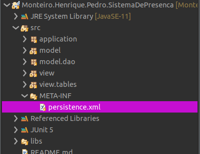

# Sistema de presença

#### Pedro Henrique Monteiro, aluno da Universidade São Francisco no curso de Tecnologia em Analise e Desenvolvimento de Sistema, cursando o último semestre.

## Descrição
Sistema que permite controlar a presença dos alunos em um determinado curso;

## Tecnologia utilizadas
> [JAVA](https://www.java.com/pt_BR/)

> [JPA](https://docs.spring.io/spring-data/jpa/docs/current/reference/html/#reference)

> [Hibernate](https://hibernate.org/)

> [Java Swing](https://docs.oracle.com/javase/7/docs/api/javax/swing/package-summary.html)

> [MYSQL](https://www.mysql.com/)

### Instalação

Os requisitos para fazer funcionar são o Java e o MySQL.
Para rodar o código basta você clonar esse repositório e alterar as configurações do arquivo src.META-INFO.persistence.xml.

Altere o nome da unidade de persistencia para o que você deseja:

Caso tenha alterado o nome, alterar também a classe conexão com o novo nome:

Altere as configurações para ficar compatível com seu MySQL

|Tecnologia|DOWNLOAD|
|----------|--------|
|   JAVA   |[https://www.java.com/pt_BR/download/]|
|   MySQL  |[https://www.mysql.com/products/community/]|

### Interfaces gráficas

#### Tela inicial
Tela inicial da aplicação, mostra os dados disponíveis no banco de dados.

#### Tela Materia
Tela para adicionar, remover e editar uma matéria.

#### Tela turmas
Tela para adicionar, remover e editar turmas e alunos, podendo filtar os alunos pela turma é nessa tela que ocorre a lógica do sistema de atribuir faltas e contabilizar os dias que houve aula.

#### Tela relatório
Tela que mostra um relatório básico das informações disponíveis aplicação.

